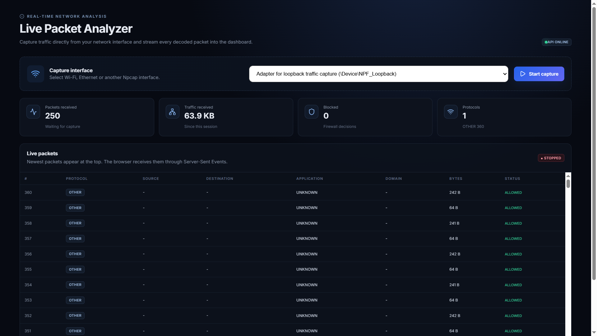

# 🔎 Packet Analyzer — Java Edition

<div align="center">

**Real-Time Network Traffic Analysis & Deep Packet Inspection in Java 21**

A Java-based network traffic analysis platform for capturing, decoding, inspecting, classifying, and monitoring network traffic through a modern web dashboard.

[](https://www.oracle.com/java/)
[](https://maven.apache.org/)
[](https://www.pcap4j.org/)
[](https://npcap.com/)
[](https://vitejs.dev/)

</div>

---

## 📌 Overview

**Packet Analyzer — Java Edition** is a network traffic analysis project that combines **offline PCAP analysis** with **real-time packet capture and monitoring**.

The backend is implemented in **Java 21** and uses **Pcap4J + Npcap** for live packet capture on Windows. A React/Vite dashboard receives decoded packet events through **Server-Sent Events (SSE)** and displays traffic in real time.

The project demonstrates practical concepts in computer networking, cybersecurity, deep packet inspection, concurrent programming, packet processing, and real-time web applications.

---

## 🖥️ Real-Time Dashboard

The dashboard provides live visibility into captured traffic, including packet count, traffic volume, protocols, source/destination endpoints, applications, domains, and firewall decisions.



> **Live capture:** The Java backend must run on a machine with Npcap and a supported network interface. The browser connects to that backend through the HTTP API and SSE stream.

---

## ✨ Features

### 📡 Real-Time Packet Capture
- Capture packets directly from supported network interfaces.
- Windows support through **Npcap + Pcap4J**.
- Discover available Npcap interfaces.
- Start and stop capture from the dashboard.
- Stream packet events to the browser using **Server-Sent Events (SSE)**.

### 🔬 Deep Packet Inspection
- Ethernet frame parsing.
- VLAN handling.
- IPv4 parsing.
- TCP and UDP parsing.
- TLS ClientHello / SNI extraction.
- HTTP Host extraction.
- DNS query extraction.
- Basic QUIC / HTTP/3 classification.
- Application classification for common services.

### 🔗 Flow Tracking
Tracks network connections using the five-tuple:

```text
Source IP
Destination IP
Source Port
Destination Port
Protocol
```

Per-flow information includes traffic volume, application, domain, and blocking state.

### 🛡️ Rule-Based Filtering

Rules can be defined for:

- IP addresses
- Ports
- Domains
- Applications

Example:

```text
BLOCK_IP=192.168.1.10
BLOCK_PORT=443
BLOCK_DOMAIN=*.facebook.com
BLOCK_APP=NETFLIX
```

Wildcard domains such as `*.example.com` are supported.

### 📊 Statistics

The analyzer maintains concurrent statistics for:

- Total packets
- Total bytes
- Forwarded packets
- Dropped/blocked packets
- Protocol activity
- Applications
- Active flows

### 💾 PCAP Processing

The project also supports standard PCAP reading, analysis, and filtered PCAP output for offline traffic inspection.

---

## 🏗️ Architecture

```text
                    ┌──────────────────────┐
                    │   Network Interface  │
                    │      Wi-Fi / LAN     │
                    └──────────┬───────────┘
                               │
                               ▼
                    ┌──────────────────────┐
                    │   Npcap + Pcap4J     │
                    │   Live Packet Capture │
                    └──────────┬───────────┘
                               │
                               ▼
                    ┌──────────────────────┐
                    │  LivePacketSource    │
                    └──────────┬───────────┘
                               │
                               ▼
                    ┌──────────────────────┐
                    │   Capture Manager    │
                    │ Queue + Processing    │
                    └──────────┬───────────┘
                               │
                               ▼
                    ┌──────────────────────┐
                    │    Packet Parser     │
                    └──────────┬───────────┘
                               │
              ┌────────────────┼────────────────┐
              ▼                ▼                ▼
       ┌────────────┐   ┌────────────┐   ┌─────────────┐
       │ Flow       │   │ DPI        │   │ Firewall    │
       │ Tracking   │   │ Inspector  │   │ Rules       │
       └─────┬──────┘   └─────┬──────┘   └──────┬──────┘
             │                │                 │
             └────────────────┼─────────────────┘
                              ▼
                    ┌──────────────────────┐
                    │  Statistics Engine   │
                    └──────────┬───────────┘
                               │
                               ▼
                    ┌──────────────────────┐
                    │ Java HTTP API + SSE  │
                    └──────────┬───────────┘
                               │
                               ▼
                    ┌──────────────────────┐
                    │ React + Vite         │
                    │ Live Dashboard       │
                    └──────────────────────┘
```

---

## 🔄 Real-Time Data Flow

```text
Network Traffic
      ↓
Npcap
      ↓
Pcap4J
      ↓
LivePacketSource
      ↓
CaptureManager
      ↓
Packet Parser
      ├──→ Flow Tracker
      ├──→ DPI Inspector
      ├──→ Application Classifier
      ├──→ Firewall Rules
      └──→ Statistics
              ↓
        JSON Packet Event
              ↓
        HTTP / SSE Server
              ↓
       Browser EventSource
              ↓
       Live Packet Table
```

---

## 📁 Project Structure

```text
packet-analyzer-java/
│
├── frontend/
│   ├── src/
│   ├── package.json
│   └── ...
│
├── src/
│   └── main/
│       └── java/
│           └── com/
│               └── packetanalyzer/
│                   ├── capture/
│                   ├── dpi/
│                   ├── firewall/
│                   ├── flow/
│                   ├── packet/
│                   ├── realtime/
│                   ├── stats/
│                   └── web/
│
├── docs/
│   └── screenshots/
│       └── live-dashboard.png
│
├── pom.xml
└── README.md
```

---

## 🧰 Technology Stack

| Layer | Technology |
|---|---|
| Language | Java 21 |
| Build | Maven 3.9+ |
| Packet Capture | Pcap4J |
| Windows Driver | Npcap |
| Backend API | Java HTTP Server |
| Real-Time Transport | Server-Sent Events (SSE) |
| Frontend | React + Vite |
| Packet Format | PCAP |
| Concurrency | ExecutorService / concurrent collections |
| Analysis | DPI, flow tracking, classification |
| Platform | Windows for Npcap live capture |

---

## ⚙️ Requirements

For real-time capture:

- JDK 21
- Maven 3.9+
- Node.js and npm
- Npcap
- A supported network interface
- Windows

Verify Java:

```bash
java -version
```

Verify Maven:

```bash
mvn -version
```

---

## 🚀 Build the Backend

From the project root:

```bash
mvn clean package
```

The packaged JAR will be created at:

```text
target/packet-analyzer-1.0.0.jar
```

---

## ▶️ Start the Real-Time Backend

```bash
java -jar target/packet-analyzer-1.0.0.jar server 8080
```

The API runs at:

```text
http://localhost:8080
```

### API Endpoints

| Endpoint | Method | Purpose |
|---|---:|---|
| `/api/health` | GET | Check API status |
| `/api/interfaces` | GET | List capture interfaces |
| `/api/capture/start` | POST | Start capture |
| `/api/capture/stop` | POST | Stop capture |
| `/api/capture/status` | GET | Get capture status |
| `/api/stream` | GET | Receive live packet events |

---

## 🌐 Start the Frontend

```bash
cd frontend
npm install
npm run dev
```

Then open:

```text
http://localhost:5173
```

---

## 🧪 Real-Time Testing

1. Start the Java backend.
2. Start the React/Vite frontend.
3. Open the dashboard.
4. Select the active physical network adapter.
5. Click **Start capture**.
6. Generate traffic by browsing websites, running a ping, or using another network application.
7. Confirm packets appear in the live table.
8. Confirm packet count and traffic volume increase.
9. Click **Stop capture** when finished.

For Wi-Fi, select the physical Wi-Fi adapter that is actually carrying your network traffic rather than an unused virtual adapter.

---

## 🧵 Concurrency Model

The real-time capture pipeline separates packet acquisition from processing using a bounded blocking queue.

```text
Capture Thread
      │
      ▼
Bounded BlockingQueue
      │
      ▼
Processing Thread
      │
      ├── Parse
      ├── Inspect
      ├── Classify
      ├── Apply Rules
      ├── Update Statistics
      └── Publish SSE
```

This prevents browser delivery and packet analysis from being tightly coupled to the capture operation.

---

## 🔌 Example Packet Event

```json
{
  "type": "packet",
  "id": 1,
  "timestamp": 1756700000000,
  "protocol": "TCP",
  "source": "192.168.1.20:49681",
  "destination": "142.250.183.14:443",
  "bytes": 1354,
  "application": "UNKNOWN",
  "domain": "",
  "blocked": false
}
```

---

## 🛡️ Security & Privacy

Packet capture can expose sensitive network information.

Use this application only on networks and systems where you have authorization to capture and inspect traffic.

Intended uses include:

- Education
- Network troubleshooting
- Security research
- Development
- Authorized testing

Do not use the analyzer to intercept traffic without appropriate permission.

---

## 📌 Project Status

### Implemented

- [x] PCAP reading
- [x] PCAP writing/filtering
- [x] Ethernet parsing
- [x] VLAN parsing
- [x] IPv4 parsing
- [x] TCP/UDP parsing
- [x] Flow tracking
- [x] TLS SNI inspection
- [x] HTTP Host inspection
- [x] DNS inspection
- [x] QUIC/HTTP3 basic classification
- [x] Application classification
- [x] Rule-based filtering
- [x] Concurrent statistics
- [x] Windows Npcap integration
- [x] Pcap4J live capture
- [x] Real-time HTTP API
- [x] Server-Sent Events
- [x] React/Vite dashboard
- [x] Start/stop capture from dashboard
- [x] Live packet table

### Future Improvements

- [ ] IPv6 deep inspection
- [ ] More application signatures
- [ ] Advanced TLS metadata
- [ ] Persistent packet history
- [ ] Advanced traffic charts
- [ ] User-configurable BPF filters
- [ ] Authentication and authorization
- [ ] HTTPS/WSS deployment
- [ ] Remote capture agent architecture
- [ ] Linux/macOS live-capture support
- [ ] Expanded automated test coverage

---

## 🎓 Academic & Learning Value

This project demonstrates practical implementation of:

- Computer networking
- Network protocol analysis
- Deep Packet Inspection
- Network security
- Firewall rule evaluation
- Producer-consumer architecture
- Java concurrency
- PCAP processing
- HTTP APIs
- Server-Sent Events
- Real-time web applications

It is suitable for MCA-level demonstrations and academic work in networking, cybersecurity, and software engineering.

---

## 🧑‍💻 Development

Backend:

```bash
mvn clean package
java -jar target/packet-analyzer-1.0.0.jar server 8080
```

Frontend:

```bash
cd frontend
npm install
npm run dev
```

Git:

```bash
git checkout main
git pull origin main
git add .
git commit -m "Update packet analyzer"
git push origin main
```

---

## ⚠️ Troubleshooting

### API is offline

Start the Java backend:

```bash
java -jar target/packet-analyzer-1.0.0.jar server 8080
```

### No interfaces appear

Verify that Npcap is installed and running.

### Interface opens but no packets appear

Select the physical network adapter that is currently carrying traffic.

### Packets appear as `OTHER`

The captured frame may not match one of the currently supported parsing/classification paths. The packet can still contribute to packet and byte statistics.

### Frontend cannot connect to the backend

Verify:

```text
http://localhost:8080/api/health
```

and make sure the frontend is configured to use the same backend address and port.

---

## ⭐ Project Summary

**Packet Analyzer — Java Edition** combines low-level packet capture, protocol parsing, deep packet inspection, flow tracking, application classification, rule-based filtering, concurrent processing, and a real-time browser dashboard.

The project demonstrates the complete path from **network interface → packet capture → analysis → firewall decision → statistics → live web visualization**.

---

## 📄 License

This project is intended for educational, academic, development, and authorized network-analysis purposes.

If you distribute the project, add the license terms appropriate for your repository and its dependencies.
